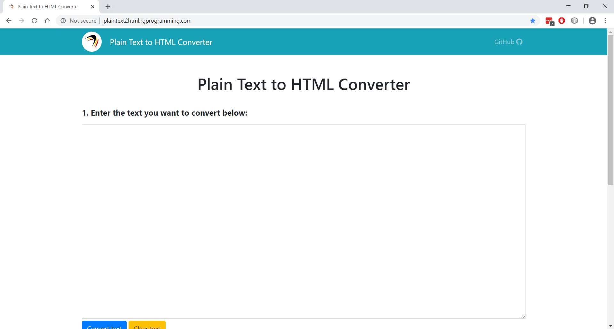

# Plain Text to HTML Converter and Encoder

I try to document my work as much as possible, and when I'm done, I usually have to convert all or some of the documentation to HTML. However, I've found that using apps like Word provide me with too much markup; sometimes it's easier to just add in the HTML myself. Therefore, I've written a very basic and lightweight text to HTML converter to help me out. Try it out live at <a href="http://localhost:8383/PlainText2HTML/index.html" target="_blank" title="">http://localhost:8383/PlainText2HTML/index.html</a>; hopefully, it will make your life easier as well.
